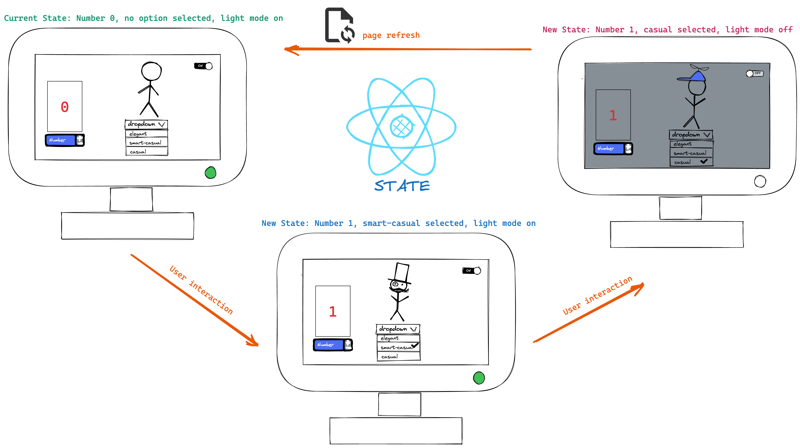
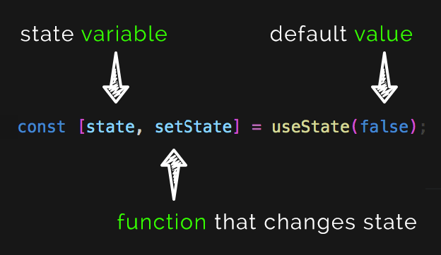
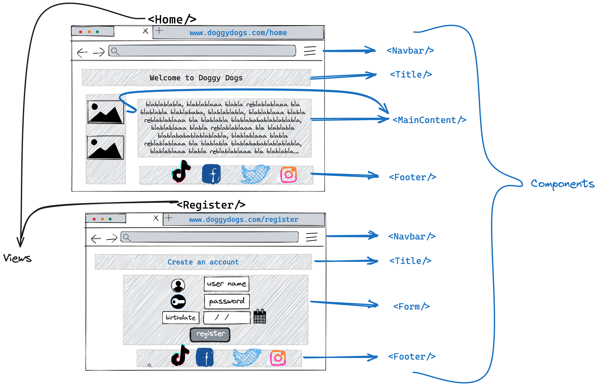

# Props, State and useState()

## Props

[React Docs: Props](https://react.dev/learn/passing-props-to-a-component)

**Props** are how you can pass data from one Component to another. This is essentially **Parameters** and **Arguments**, with specific Component syntax. The keyword **props** always exists as a Parameter in React Functional Components. If we log it to the console, it will show an empty object. One default property on the props object is **children**, which refers to any content _between_ the Component's opening and closing tags. We've only been using self-closing Components up until now, but we can test passing data down through the `props.children`.

We can add other properties to the props object by putting them as properties in the opening tag of the Component. You can pass any JavaScript variable as props, including expressions and functions. You're essentially creating the key/value pair to add to the props object when you add a prop to pass into a Component. A shortcut way of accessing the props values is to **destructure** the object.

```jsx
<MyComponent name={"Raúl"} hometown={"Salamanca"} />;

// props object will look like:
const props = {
  name: "Raúl",
  hometown: "Salamanca",
};
```

Inside the component `<MyComponent/>`, the props received will look like this

```jsx
function MyComponent(props) {
  return (
    <div>
      <p>My Name is {props.name}</p>
      <p>I was born in {props.hometown}</p>
    </div>
  );
}
export default MyComponent;
```

Since `props` is an object, if we prefer, we can use destructuring to access the name of the properties directly.

```jsx
function MyComponent({name, hometown}) {
  return (
    <div>
      <p>My Name is {name}</p>
      <p>I was born in {hometown}</p>
    </div>
  );
}
export default MyComponent;
```

I like to demonstrate this in a single file to hopefully help you understand why passing data **downstream** works, but passing data back **upstream** doesn't. You have to think carefully about the structure of your project to make sure all Components that need certain data are able to access it. Later, we'll learn some different ways to pass data that sidestep this limitation, but for this exercise concentrate on where data is coming from, where you're using it, and how it's being passed from A to B.

- How to pass data **upstream** :
  
  First we need to create a function in the parent component, that receives as parameter the data that will be sent from the child component.

  ```jsx
  function ParentComponent() {
      const getDataFromChild = (data) => {
        console.log(data);
      };
      return (
        <div>
          <ChildComponent getDataFromChild={getDataFromChild } />
        </div>
      );
    }
  export default ParentComponent;
  ```

In `ChildComponent` we receive the function `getDataFromChild` as props, and we call it using an event (click, hover, etc...).

  ```jsx
    function ChildComponent({getDataFromChild}) {
      const sendData = () => {
        getDataFromChild("Hello parent component!")
      };
      return (
        <div>
          <button onClick={sendData} />
        </div>
      );
    }
    export default ChildComponent;
  ```

The string `Hello Parent component` will be printed to the console, thanks to the `console.log(data)` we have in the parent component, hence the data traveled **upstream** from `ChildComponent` to `ParentComponent`.

## State

[React Docs: State](https://react.dev/learn/state-a-components-memory)

One interpretation as to why _React_ was named as such is because it is "reacting" to changes (as pointed out by Dan Abramov in [this talk](https://www.youtube.com/watch?v=dpw9EHDh2bM&t=3455s)).

What we mean by _reacting_ to changes is that React enables dynamic updates to a user interface based on certain actions or events. This could include seeing the next picture of an instagram post when clicking ▶️, increasing the number of likes after pressing a ❤️ button, adding items to a shopping cart after clicking ➕, or seeing our name appear in an input field after typing it. Essentially, React will update the content of the screen, after those actions.

But how does React know that it has to update the content of the screen 🤔? The same as in real life. How do we know that a traffic light 🚦 changed color? because we **remember** what the previous color was before the new one.

The memory of what is the number of likes before whe click the button, what is the text on the screen before pressing a new key, or what is the image on the screen before clicking next, is what we call **State**.

This concept of remembering and managing previous states is crucial in React programming and is encapsulated in the notion of **State**.

---
Let's see how React works to changes in regular variables.

Let's create an `<input />` to go with our `<button />`, then write some code to have the button change the value of a variable we're displaying in our return to the value typed by a user into the input.

```jsx
function App() {
  let myName = "Raúl";
  let newName = "";

  function handleChange (event) {
    console.log("input", event.target.value)
    newName = event.target.value;
  }

  function handleClick () {
    console.log("before", myName);
    myName = newName
    console.log("after", myName);
  }

  return (
    <div>
      <p>My name is: <b>{ myName }</b></p>
      <input onChange={handleChange}/>
      <br/><br/>
      <button onClick={handleClick}>Click me! </button>
    </div>
  )
}
```

What I want to happen is for the variable `myName` to be reinitialized with the same value as `newName`, and then for me to _see_ 👀 the change in the DOM. We can see in the console that the value of the variable is updating, but the DOM stays the same. This is because React doesn't re-render for a regular variable change. Remember how much work that was in Vanilla JS? To remove the existing value, then add new ones? It isn't going to do all of that unless it knows it needs to.



However React will know it needs to do this, if what is changing is a **state**. To create a state variable, we will use the `useState()` hook 🪝.

## useState Hook

### What is a React Hook 🪝?

A hook is a special function that allows us to use states and other React features within a (functional) component.

Given that they are a bit special, React has provided us with some rules for using them.

- Rules of Hooks:
  - ✅ They need to start with the prefix **use**.
  - ✅ They need to be imported from React `import {useState} from "React"`, at the top of the component.
  - ✅ Call them at the top level in the body of a function component (and not inside another function nested in the component)
  - 🔴 Do not call Hooks inside conditions or loops.
  - [More rules here](https://react.dev/warnings/invalid-hook-call-warning)

### useState()

`useState` is a React Hook that lets you add a _state variable_ to your components. [React Docs](https://react.dev/reference/react/useState).

It takes an **initial value** as an argument and returns an array containing the **current state** value and a **function to update** that value. By calling this function, React **re-renders the component** with the updated state.



Let's update our previous example, by turning our regular `let newName` variable, into a _state variable_ using this hook.

```jsx
function App() {
  const myName = "Raúl";
  const [newName, setNewName] = useState("");
  const [displayName, setDisplayName] = useState(myName);

  function handleChange(event) {
    setNewName(event.target.value);
  }

  function handleClick() {
    setDisplayName(newName);
  }

  return (
    <div>
      <p>
        My name is: <b>{displayName}</b>
      </p>
      <input onChange={handleChange} />
      <br />
      <br />
      <button onClick={handleClick}>Click me! </button>
    </div>
  );
}
```

Thanks to the use of `useState` hook, now our `<App/>` component contains two _states_. React "remembers" that the current value of both ("" for `newName` and "Raúl" for `displayName`). And every time we modify their value using the **set** function that `useState` give us, React "knows" they have changed (because it "remembers" the previous value), and "reacts" by re-rendering the component, to reflect the new value in the screen.

## Views/Pages vs Components

As you can observe in this project, within the `src/` , where we are writting all our React code, we have two folders in which we are creating components, `/components` and `/pages`.

The components we create in `/pages` (or `/views`), we store the components that are gonna be rendered in our screen when we navigate to specific pages of our apps. They will usually correspond to different URLs.
  
For example, if we navigate to `www.ourApp.com/contact`, our app would render the component `<Contact/>`. At the same time, this component could be "composed" of smaller components, such as `<NavBar/>` or  `<Footer/>` , that they are created inside the folder `/components` and can be reused in other components.

```jsx
// src/pages/Contact.jsx
//this component will render when we navigate to www.ourApp.com/contact
function Contact() {
  return (
      <div>
        <h1>Contact</h1>
        <Navbar />
        <div>
          <p>Our Contact details are:....</p>
        </div>
        <Footer/>
    </div>
  );
}

// src/components/Footer.jsx
//this component will be rendered everytime the component <Contact> renders
function Footer() {
  return (
    <div>
      <p>legal info</p>
    </div>
  );
}
```


